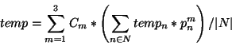

# Parallel Heat Propagation

## Original Specifications/Project Requirements
Also viewable [here](https://web.archive.org/web/20231130023630/https://gee.cs.oswego.edu/dl/csc375/a3V2.html).

A. Consider a rectangular piece of metal alloy, four times as wide as high, consisting of three different metals, each with different thermal characteristics. For each region of the alloy, there is a given amount (expressed in terms of a percentage) of each of the three base metals, that varies up to 25 percent due to random noise. The top left corner (at the mesh element at index [0,0]) is heated at $S$ degrees Celsius and the bottom right corner (index [width - 1,height - 1]) is heated at $T$ degrees Celsius. The temperature at these points may also randomly vary over time.

Your program calculates the final temperature for each region on the piece of alloy. The new temperature for a given region of the alloy is calculated using the formula 

(MY NOTE: Formula image may not show up well on dark mode.)

where $m$ represents each of the three base metals, $C_m$ is the thermal constant for metal $m$, $N$ is the set representing the neighbouring regions, $temp_n$ is the temperature of the neighbouring region, $p^{m}_{n}$ is the percentage of metal $m$ in neighbour $n$, and $\vert N\vert$ is the number of neighbouring regions. This computation is repeated until the temperatures converge to a final value or a reasonable maximum number of iterations is reached.

The values for $S$, $T$, $C_1$, $C_2$, $C_3$, the dimensions of the mesh, and the threshold should be parameters to the program. Note however, that combinations of these parameters do not do not converge well. Try values of (0.75, 1.0, 1.25) C1, C2, C3 for your test/demo.

Assume that the edges are maximally insulated from their surroundings.

Your program should graphically display the results by drawing a grid of points with intensities or colors indicating temperature. (Alternatively, you can just output them to a file and use something like gnuplot to display them.)

    Acknowledgment: This assignment was adapted from a study by Steve MacDonald. 

B. Reimplement using SIMD parallelism, a GPU, or multiple servers.

## Command Line Arguments
The program takes up to 9 arguments.

In order:

- S - Double. Temp to heat top left corner in degrees Celsius.

- T - Double. Temp to heat bottom right corner in degrees Celsius. 

- C1 - Double. Thermal constant for metal 1.
            
- C2 - Double. Thermal constant for metal 2.
            
- C3 - Double. Thermal constant for metal 3.
            
- height - Integer. Height of grid.

- threshold - Integer. When to stop iterating.

- debug - (Optional) Boolean. Print debug statistics during data load.

- network - (Optional) Boolean. Whether to use networked mode (Part B).  Requires 3 running servers.

### Example Valid Arguments
`100 500 1 .75 1.25 40 10000 true false`

## Part A
The project accomplishes the heat propagation simulation by using divide-and-conquer methods, breaking
the grid of cells from a "read grid" into smaller chunks that are worked on with workers that extend [RecursiveAction](https://docs.oracle.com/javase/8/docs/api/java/util/concurrent/RecursiveAction.html)
and are executed by a [ForkJoinPool](https://docs.oracle.com/javase/8/docs/api/java/util/concurrent/ForkJoinPool.html).
We start with one worker which checks to see if it has more than a specified threshold of rows.  If so,
it divides its given section of the grid into quadrants and spawns a new worker for each quadrant.  If
it has less than the threshold, it calculates the temperature in each of its given cells based on the temperatures
and alloy compositions of its neighbors.  The new temperatures get written to the cell's corresponding
"write grid" cell.  Once all workers in the ForkJoinPool have finished, the read and write grids swap -
in other words, the previous read grid is the new write grid and vice versa - and the process is started again
until a specified number of iterations is reached.  A GUI displays the current read grid every so many milliseconds.

## Part B
I chose networking for this part, which utilizes 3 instances of running server code (these can run locally).
A corresponding worker on the client side handles communication with its designated server, which is
tracked and executed using a [CountDownLatch](https://docs.oracle.com/javase/8/docs/api/java/util/concurrent/CountDownLatch.html) and [ExecutorService](https://docs.oracle.com/javase/8/docs/api/java/util/concurrent/ExecutorService.html).  You could also use a [Phaser](https://docs.oracle.com/javase/8/docs/api/java/util/concurrent/Phaser.html) instead of a latch.
The client splits the grid up into 3 sets of rows with 1 row overlap when not an edge, each set handled by the aforementioned worker.  This overlap
is required for the servers to have the neighbors for calculation of the rest of the cells, and
the overlapped cells will be marked as "do not calculate".

NOTE: If you are doing this project for class, DL will prefer you to find a way to calculate edges server-side then combine
them on return.  He has example code [here](https://gee.cs.oswego.edu/cgi-bin/viewcvs.cgi/jsr166/jsr166/src/test/loops/) (the ones with 'Jacobi' in the name are what you want to look at).

Each server instance will do the same thing as a single iteration of the process outlined in Part A with its 
section, but will not calculate the temperatures of cells marked "do not calculate".  Once the server is done,
it will return its write grid to the client, which will then write all temperatures for cells not marked
"do not calculate" to the main write grid.  Once all servers have done their work and returned and the
write grids are processed, it swaps the read and write grids and iterates through until it reaches the specified threshold.

## Pitfalls and Advice
This section is specifically for those taking CSC375 at SUNY Oswego.

- **DO NOT UNDERESTIMATE THIS PROJECT**.  It takes time, and you need to allow yourself space to get
frustrated, walk away and come back to it.

- Your alloy percentage calculations are **CRITICAL**.  Issues in these can lead to wild, incorrect values that run to infinity.
This can happen for two reasons that I have found: some alloy percentages don't play nicely with the coefficients you provide
on startup, and floating point errors.  The given arguments above are solid values to work with. The way I found to handle the floating point errors was calculate my alloy percentages as
integers, then convert them to doubles and divide by 100 - those will give you nice, clean 2-decimal place
percentages.

- Other students did not realize they needed the rotating matrix pattern - you do, otherwise you will
overwrite cell temperatures required for neighbor calculations.  In other words, you will calculate the temperature
of a cell and overwrite this value when the old value is required as a neighbor for a temperature calculation on a different cell.  You will
get a mess and unexpected results on your hands.

- The project does not specifically require a live GUI of the grid, but having one is an invaluable 
debugging tool.  Just modify the code from your Project 1 GUI, it's honestly that simple.

- Originally I used "x" and "y" for labelling coordinates, but since these are pretty much flipped (top
left corner is specified to be at (0,0)) I spun my wheels on this getting confused for hours debugging 
just because of the cognitive hang-up.  Using "row" and "col" for labelling coordinates helped immensely.

- You can set yourself up for the most success for the networked part of Part B if you keep it in mind for
your approach to Part A.  For me, this meant making my calculations agnostic to the "global" grids.

- The networked option is the easiest of the three for Part B.  I heard horror stories about the SIMD
version, and there is not an official Java library for CUDA, so you'll have to rewrite in another language.
If you're on a time crunch, networking is probably your quickest way to success.  I knocked it out in a little less than a day; 
Part A took me a couple weeks.  This isn't to dissuade you from doing one of the other two if you want to
explore, just plan your time and energy accordingly (it mainly goes back to the "do not underestimate this project" part).

- You may find that your server/client code runs perfectly locally, but it stalls after a while when your
client is local and your servers are on a CS server - especially Moxie.  Run everything on the CS server
and SSH in with X-forwarding so you can see your GUI.  I'm pretty sure traffic gets throttled if you hit the CS
servers over the wire, and Moxie is notoriously unstable for some projects.

## Other Notes
You'll notice that there are something like 15 classes in here.  Don't let that scare you - a lot of it is
duplicated because I didn't structure my code in a modular way in Part A, which meant that server code needed
a lot of the same stuff in its own module.  There are also probably several methods in here that are unused;
they were useful at the time when I was still figuring stuff out, but I didn't get around to clearing them out when they went unused.

Servers get sent a stack of rows instead of quadrants because I was hitting my head into a wall over wrapping
my head around the columns, marking the column cells as "do not calculate", and properly splitting everything
up ("Chunker.java" is probably a bit more spaghetti than it should be).  When you're near the end of the
semester, running on caffeine and fumes, you get a bit desperate.  You may have better luck figuring out a
more optimal solution.